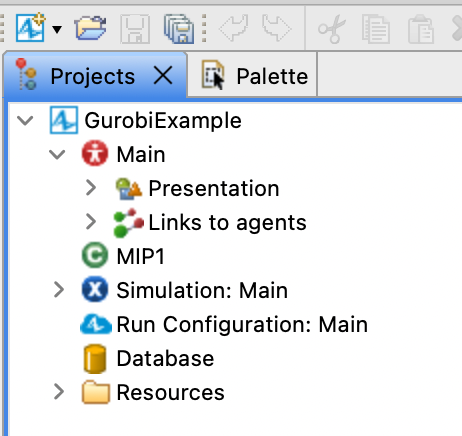

# Gurobi_Anylogic_Example
A simple example of calling Gurobi from Anylogic (GurobiExample.alp)

Before running you should verify you can compile and run a simple java example outside of Anylogic, from your command line.  E.g. navigate to the examples/java directory of your Gurobi installation and run
```
javac -classpath .:/Library/gurobi1103/macos_universal2/lib/gurobi.jar Diet.java

java -cp .:/Library/gurobi1103/macos_universal2/lib/gurobi.jar Diet
```

The structure of the project is as follows:



The MIP1 class is based off the Mip1 java example, which can be found here:
https://docs.gurobi.com/projects/examples/en/current/examples/mip1.html

The static main method has been modified to be a public method.


The Main agent contains a simple button which instantiates a new MIP1 object and runs it


In the project settings you need to add the gurobi.jar file as a dependency.  The jar file is inside the lib directory of the Gurobi installation folder.  It's location on your machine may be different.


Expected result:

